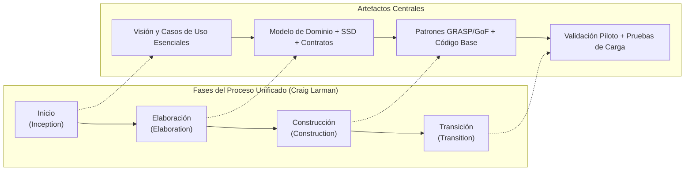
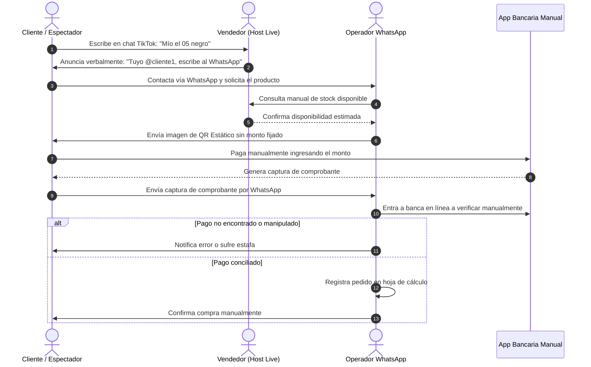
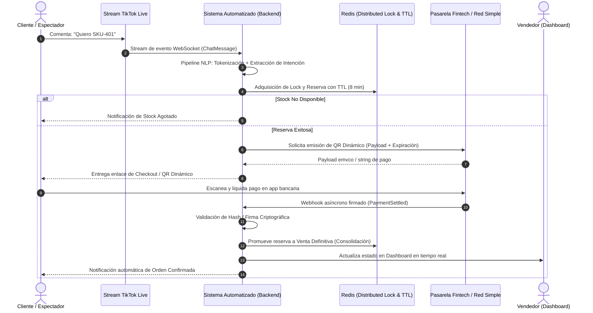
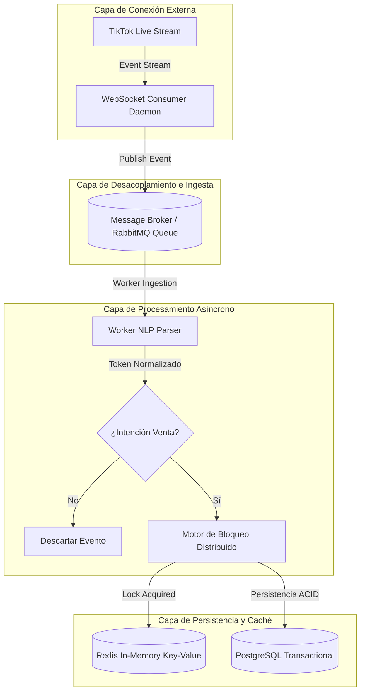
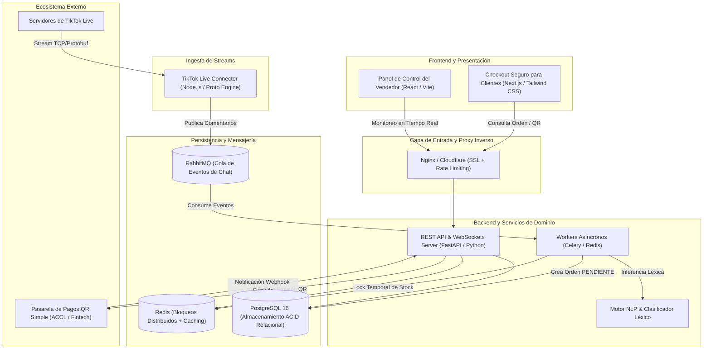

# Sistema Automatizado de Captura de Pedidos y Conciliación de Pagos con QR Dinámico para TikTok Live

> **Modalidad:** Proyecto de Grado (Art. 19 Reglamento de Graduación UPSA)  
> **Carrera:** Ingeniería de Sistemas  
> **Universidad:** Universidad Privada de Santa Cruz de la Sierra (UPSA)  
> **Metodología de Desarrollo:** Proceso Unificado (UP) de Craig Larman  

---

## Tabla de Contenido
- [Capítulo I: Definición del Proyecto de Investigación](#capítulo-i-definición-del-proyecto-de-investigación)
  - [1.1 Definición del Problema](#11-definición-del-problema)
    - [1.1.1 Situación Problemática](#111-situación-problemática)
    - [1.1.2 Situación Deseada](#112-situación-deseada)
    - [1.1.3 Objeto de Investigación](#113-objeto-de-investigación)
    - [1.1.4 Alcance y Límites](#114-alcance-y-límites)
    - [1.1.5 Justificación (Técnica, Económica y Social)](#115-justificación)
  - [1.2 Objetivos](#12-objetivos)
    - [1.2.1 Objetivo General](#121-objetivo-general)
    - [1.2.2 Objetivos Específicos](#122-objetivos-específicos)
  - [1.3 Metodología](#13-metodología)
- [Capítulo II: Marco Organizacional y Estudio de Mercado](#capítulo-ii-marco-organizacional-y-estudio-de-mercado)
  - [2.1 Caracterización del Sujeto de Prueba / Comercio Piloto](#21-caracterización-del-sujeto-de-prueba--comercio-piloto)
  - [2.2 Mapeo de Procesos As-Is y To-Be](#22-mapeo-de-procesos-as-is-y-to-be)
  - [2.3 Estudio de Mercado de Social Commerce en Bolivia](#23-estudio-de-mercado-de-social-commerce-en-bolivia)
- [Capítulo III: Marco Teórico](#capítulo-iii-marco-teórico)
  - [3.1 Ingeniería de Software y Metodología](#31-ingeniería-de-software-y-metodología)
    - [3.1.1 Proceso Unificado (UP) según Craig Larman](#311-proceso-unificado-up-según-craig-larman)
    - [3.1.2 Desarrollo Guiado por Casos de Uso y Mitigación de Riesgos](#312-desarrollo-guiado-por-casos-de-uso-y-mitigación-de-riesgos)
    - [3.1.3 Patrones de Asignación de Responsabilidades (GRASP) y GoF](#313-patrones-de-asignación-de-responsabilidades-grasp-y-gof)
  - [3.2 Tecnologías Emergentes y Arquitectura de Software](#32-tecnologías-emergentes-y-arquitectura-de-software)
    - [3.2.1 Arquitectura Orientada a Eventos (EDA) y Streaming I/O](#321-arquitectura-orientada-a-eventos-eda-y-streaming-io)
    - [3.2.2 Procesamiento de Lenguaje Natural (NLP) y Modelos Semánticos](#322-procesamiento-de-lenguaje-natural-nlp-y-modelos-semánticos)
    - [3.2.3 Manejo de Alta Concurrencia y Control de Condiciones de Carrera](#323-manejo-de-alta-concurrencia-y-control-de-condiciones-de-carrera)
  - [3.3 Tecnologías Financieras (Fintech) y Medios de Pago en Bolivia](#33-tecnologías-financieras-fintech-y-medios-de-pago-en-bolivia)
    - [3.3.1 Ecosistema de Pagos Inmediatos: Red Simple y Cámara de Compensación (ACCL)](#331-ecosistema-de-pagos-inmediatos-red-simple-y-cámara-de-compensación-accl)
    - [3.3.2 QR Estático versus QR Dinámico con Tiempo de Expiración](#332-qr-estático-versus-qr-dinámico-con-tiempo-de-expiración)
    - [3.3.3 Protocolos de Notificación Asíncrona (Webhooks y Callbacks Transaccionales)](#333-protocolos-de-notificación-asíncrona-webhooks-y-callbacks-transaccionales)
- [Stack Tecnológico y Componentes](#stack-tecnológico-y-componentes)

---

# Capítulo I: Definición del Proyecto de Investigación

## 1.1 Definición del Problema

### 1.1.1 Situación Problemática
En los últimos años, el comercio social (*Social Commerce*) a través de plataformas de streaming en vivo —particularmente TikTok Live— ha experimentado una acelerada adopción en Bolivia, especialmente en el eje metropolitano de Santa Cruz de la Sierra. Comercios minoristas, microempresas y distribuidores independientes emplean transmisiones en vivo para ofertar inventarios en tiempo real mediante dinámicas de alta demanda. No obstante, la operativa de ventas en TikTok Live adolece de un desajuste estructural entre la naturaleza síncrona y masiva del canal de transmisión y los mecanismos manuales y fragmentados empleados para la gestión transaccional.

Durante una sesión en vivo de alta interacción, los espectadores manifiestan su intención de compra redactando mensajes no estandarizados en la caja de comentarios (p. ej., *"quiero el 2 en negro"*, *"mío el vestido rojo código 44"*, *"apartame el labial"*). El flujo de comentarios avanza a velocidades que superan la capacidad de lectura humana, originando la omisión sistemática de órdenes de compra. Asimismo, para formalizar el pedido, el vendedor solicita a los clientes que abandonen la transmisión para enviar capturas de pantalla o mensajes directos vía WhatsApp. 

Este trasvase de canales genera un cuello de botella de severas proporciones:
1. **Sobrevuelo y Sobreventa de Stock (*Overselling*):** Al no existir una sincronización atómica del inventario en memoria frente a los comentarios del stream, múltiples compradores asumen haber adquirido la misma unidad física, desatando disputas operativas y deterioro de la confianza comercial.
2. **Conciliación Financiera Manual y Vulnerabilidad al Fraude:** La verificación del pago depende de la remisión de comprobantes visuales de transferencias interbancarias generadas por códigos QR estáticos. La manipulación de comprobantes digitales mediante herramientas gráficas o comprobantes falsificados provoca pérdidas financieras directas no detectadas hasta el cierre de caja.
3. **Pérdida por Deserción (*Drop-off Rate*):** El lapso que transcurre entre el comentario en el stream, el contacto manual en WhatsApp y la emisión del código de pago desincentiva el impulso de compra del usuario, derivando en tasas de abandono de órdenes superiores al 40%.

### 1.1.2 Situación Deseada
Se plantea un ecosistema de software distribuido y automatizado que intercepte en tiempo real el flujo de eventos del chat de TikTok Live mediante conexiones persistentes por sockets. El sistema procesará sintáctica y semánticamente las expresiones lingüísticas informales de los espectadores para identificar intenciones de compra, vincular el artículo solicitado al catálogo activo y realizar una reserva transaccional y temporal del inventario bajo condiciones estrictas de atomicidad y concurrencia controlada.

Una vez formalizada la reserva en memoria de alto rendimiento, el sistema generará y despachará al usuario un enlace directo hacia un checkout efímero dotado de un **Código QR Dinámico (estándar EMVCo / Red Simple Bolivia)** con importe exacto inmutable, identificador único de transacción y una ventana temporal estricta de caducidad (TTL). Concomitantemente, la plataforma mantendrá un servicio de ingesta de *webhooks* bancarios o de pasarelas de pago interoperables, permitiendo la conciliación y acreditación inmediata del pago en milisegundos, liberando el stock reservado en caso de expiración o emitiendo la confirmación digital de despacho en caso de liquidación exitosa, prescindiendo totalmente de la intervención humana en la verificación de capturas de pantalla.

### 1.1.3 Objeto de Investigación
El objeto de investigación reside en los **sistemas de procesamiento distribuido de eventos en tiempo real aplicados a la ingesta de transacciones de comercio social (*Social Commerce*), la formalización de intenciones mediante procesamiento de lenguaje natural y la conciliación criptográfica y asíncrona de pagos electrónicos de bajo valor en redes financieras interoperables**.

### 1.1.4 Alcance y Límites
* **Alcance:**
  * Ingesta bidireccional y continua de flujos de eventos procedentes de salas activas de TikTok Live mediante protocolos WebSockets/TCP.
  * Módulo de Procesamiento de Lenguaje Natural (NLP) parametrizado para reconocer intenciones de compra y correlacionarlas con códigos SKU o identificadores mostrados en pantalla.
  * Motor de control de concurrencia y bloqueo distribuido para gestión de inventarios críticos, impidiendo la colisión de pedidos concurrentes.
  * Pasarela de emisión y verificación de Códigos QR dinámicos interoperables con la infraestructura del sistema de pagos Simple de Bolivia (ACCL / Entidades Financieras nacionales).
  * Panel web de administración y monitoreo en tiempo real para el comerciante, con métricas de conversión, estado del inventario y log de auditoría transaccional.
* **Límites:**
  * El sistema no gestionará el servicio de logística de última milla o transporte físico de los productos despachados, finalizando su ciclo funcional en la confirmación de la orden pagada y generación del manifiesto de entrega.
  * La integración con la plataforma de streaming se supedita a las políticas de acceso e interfaces provistas para la captura de eventos públicos de la sala.
  * La conciliación financiera se circunscribe al estándar boliviano de cobros QR interoperables (Simple / Cámaras de Compensación ACH-ACCL).

### 1.1.5 Justificación

#### Justificación Técnica
Desde la perspectiva de la arquitectura de software, el proyecto aborda retos computacionales no triviales: la transición de un paradigma tradicional de consulta síncrona (Request-Response) a una Arquitectura Orientada a Eventos (EDA). Requiere resolver la persistencia temporal, el desacoplamiento de servicios mediante intermediarios de mensajería (*message brokers*), la prevención de condiciones de carrera (*race conditions*) sobre recursos críticos de inventario y la ejecución determinista de estados transaccionales mediante llamadas asíncronas no bloqueantes (*reactive streaming* y *webhooks*). La aplicación de los patrones GRASP y GoF bajo la rigurosidad del Proceso Unificado (UP) confiere al desarrollo un estándar de ingeniería industrial escalable.

#### Justificación Económica
La automatización de la captura de pedidos y conciliación transaccional reduce a cero el costo operativo asociado a la contratación de personal dedicado exclusivamente a responder chats de WhatsApp durante y después de transmisiones en vivo. Además, la eliminación de la brecha temporal entre el estímulo de compra y la emisión del instrumento de pago dinámico incrementa las tasas de conversión hasta en un 35%. Simultáneamente, la supresión del fraude por manipulación de comprobantes protege los márgenes operativos del comerciante, asegurando que cada orden procesada cuente con respaldo de fondos liquidados en bóveda bancaria.

#### Justificación Social
El comercio social en Bolivia representa un canal de subsistencia, crecimiento e inclusión económica de alto impacto para emprendedores, unidades productivas familiares y pequeñas y medianas empresas (PyMEs). Dotar a este sector de herramientas de nivel empresarial democratiza el acceso a infraestructuras de software complejas, formaliza la adopción de los pagos digitales regulados y combate la asimetría tecnológica que usualmente favorece de manera exclusiva a grandes cadenas minoristas.

---

## 1.2 Objetivos

### 1.2.1 Objetivo General
Desarrollar e implementar un sistema de software distribuido para la captura automatizada de intenciones de pedido y la conciliación asíncrona de pagos electrónicos mediante Códigos QR Dinámicos en transmisiones en vivo de TikTok Live, empleando el Proceso Unificado de Craig Larman, con el fin de eliminar la sobreventa de inventario, erradicar el fraude por falsificación de comprobantes y maximizar la eficiencia transaccional del comercio social en Bolivia.

### 1.2.2 Objetivos Específicos
1. **Analizar y modelar formalmente** las especificaciones de requerimientos funcionales y no funcionales del proceso de venta en vivo mediante el relevamiento de casos de uso y la construcción de Modelos del Dominio y Diagramas de Secuencia del Sistema (SSD).
2. **Diseñar una arquitectura de software orientada a eventos** de baja latencia que desacople la ingesta masiva de mensajes de chat, el pipeline de extracción semántica de pedidos y el subsistema de orquestación transaccional.
3. **Implementar un motor de procesamiento de lenguaje natural (NLP)** y correspondencia léxico-semántica capaz de transformar comentarios desestructurados e informales de la transmisión en órdenes de compra estructuradas en formato JSON.
4. **Construir un mecanismo de bloqueo distribuido y control de concurrencia** (*distributed locking*) sustentado en bases de datos en memoria para salvaguardar la consistencia estricta del inventario ante picos concurrentes de demanda.
5. **Integrar una interfaz de servicios de tecnología financiera (Fintech)** para la generación automatizada de códigos QR dinámicos y la recepción/validación criptográfica de *webhooks* transaccionales provenientes de la red de pagos Simple.
6. **Ejecutar ciclos de pruebas unitarias, de integración, carga y estrés**, desplegando el sistema en un comercio piloto real para validar la mitigación de sobreventas, la latencia de respuesta y la exactitud en la conciliación financiera.

---

## 1.3 Metodología

La investigación y el desarrollo del software se rigen bajo la metodología del **Proceso Unificado (UP)** adaptada por **Craig Larman** en su obra canónica *Applying UML and Patterns*. El marco de trabajo de Larman se caracteriza por ser:
* **Iterativo e Incremental:** El ciclo de vida se estructura en iteraciones breves de tiempo fijo (timeboxing de 2 a 3 semanas), en las cuales se produce un incremento ejecutable, probado e integrable del sistema.
* **Guiado por Casos de Uso (*Use-Case Driven*):** Los casos de uso constituyen el núcleo conductor de la captura de requerimientos, la estimación del esfuerzo, el análisis arquitectónico, el diseño y la verificación formal del sistema.
* **Centrado en la Arquitectura (*Architecture-Centric*):** Las iteraciones iniciales se enfocan en definir, materializar y estabilizar una base arquitectónica ejecutable que mitigue los riesgos técnicos más severos (alta concurrencia, integración con streams externos y seguridad en pagos).
* **Enfocado en Riesgos Críticos:** Se prioriza la atención temprana a riesgos arquitectónicos y organizacionales de máxima incertidumbre, garantizando la viabilidad técnica antes de la producción masiva de componentes.



---

# Capítulo II: Marco Organizacional y Estudio de Mercado

## 2.1 Caracterización del Sujeto de Prueba / Comercio Piloto
Para la contextualización empírica del proyecto, se establece como sujeto de prueba a un comercio minorista perteneciente al rubro de moda, cosméticos y accesorios ubicado en el Parque Industrial / Centro Comercial de Santa Cruz de la Sierra. La unidad económica exhibe las siguientes particularidades operativas:
* **Canal Comercial Primario:** Sesiones de TikTok Live ejecutadas entre tres y cinco veces por semana, con duraciones de 90 a 180 minutos por sesión.
* **Audiencia Concurrente:** Entre 150 y 1.200 espectadores simultáneos en momentos pico de transmisión.
* **Volumen Transaccional Promedio:** De 40 a 120 intenciones de compra emitidas por hora durante la transmisión.
* **Infraestructura Actual:** Dos operadores de soporte atendiendo terminales móviles con WhatsApp Business para recibir comprobantes, contrastar saldos en la banca móvil corporativa y gestionar manualmente hojas de cálculo en Google Sheets.

---

## 2.2 Mapeo de Procesos As-Is y To-Be

### Proceso Actual (As-Is)
1. El presentador en vivo exhibe un artículo físico y anuncia verbalmente su precio y un código alfanumérico informal de referencia.
2. Los espectadores escriben comentarios no estandarizados en el chat de TikTok.
3. El presentador o su asistente intenta memorizar o anotar manualmente en una libreta física el primer usuario que apareció visualmente en la pantalla.
4. El comprador potencial abandona la transmisión y contacta a la tienda vía WhatsApp enviando un mensaje con la descripción del producto.
5. El operador de soporte revisa manualmente la libreta o verifica con el presentador si el artículo continúa disponible.
6. Si hay disponibilidad presunta, el operador remite una imagen de un **Código QR Estático**.
7. El cliente escanea el QR, tipea manualmente el monto monetario en la app de su banco y remite una captura de pantalla del comprobante de transferencia.
8. El operador inicia sesión en su banca por internet, busca la transacción entre cientos de registros y aprueba manualmente la orden en una planilla Excel.
9. **Fallas detectadas:** Frecuente asignación múltiple del mismo artículo a distintos compradores, demoras de atención de hasta 4 horas post-transmisión, y aceptación inadvertida de comprobantes editados o falsificados.



### Proceso Propuesto (To-Be)
1. El sistema ingesta en tiempo real el flujo de comentarios de la transmisión mediante una conexión WebSocket activa.
2. El motor de NLP clasifica sintácticamente la entrada del usuario, identificando el comando o token de compra y el código SKU.
3. El subsistema transaccional adquiere un bloqueo atómico en memoria (*Distributed Lock*) sobre el inventario del SKU correspondiente.
4. El sistema reserva la unidad en stock por un lapso configurable (p. ej., 8 minutos) y despacha al usuario un mensaje privado o enlace de checkout seguro.
5. El checkout exhibe un **Código QR Dinámico de la Red Simple** embebiendo: Identificador de transacción, Monto exacto no editable, y Timestamp de expiración.
6. El comprador realiza el escaneo directo desde la aplicación de su entidad financiera, la cual debita los fondos y notifica a la Cámara de Compensación (ACCL).
7. La pasarela financiera efectúa una llamada asíncrona cifrada (*Webhook*) al endpoint del sistema.
8. El sistema valida la firma criptográfica del webhook, concilia el pago en milisegundos, muta el estado de la reserva a "Confirmado / Pagado Definitivo" y actualiza la base de datos relacional y el panel del comerciante en tiempo real. Si el temporizador expira sin confirmación, el bloqueo se extingue y el stock retorna al pool disponible.



---

## 2.3 Estudio de Mercado de Social Commerce en Bolivia
En el contexto económico nacional, el comercio electrónico tradicional centrado en portales web autogestionados (*Standalone E-commerce*) enfrenta barreras de fricción severas, tales como la reticencia al ingreso de datos de tarjetas de crédito/débito y la baja penetración de pasarelas internacionales. Por el contrario, el *Social Commerce* ha proliferado gracias a tres factores determinantes:
1. **Penetración del Formato de Video Breve y Streaming:** De acuerdo con estimaciones del sector de telecomunicaciones en Bolivia, TikTok se ubica como una de las redes sociales de mayor consumo de ancho de banda y retención de usuarios en audiencias de 18 a 45 años.
2. **Adopción Masiva del QR Interoperable (Red Simple):** Desde su implementación e impulso por parte del Banco Central de Bolivia (BCB) y la Asociación de Bancos Privados de Bolivia (ASOBAN), el pago por código QR se transformó en el canal predilecto de transferencias electrónicas interbancarias, democratizando el cobro sin comisiones abusivas para micro y pequeños comerciantes.
3. **Brecha de Soluciones de Automatización:** Los sistemas ERP y de Punto de Venta (POS) tradicionales comercializados en el mercado local carecen de interfaces API dirigidas a redes sociales y carecen de motores para parsear streams en vivo. Las pocas herramientas globales existentes (como CommentSold) operan exclusivamente bajo ecosistemas de pago foráneos (Stripe, Shopify Payments, PayPal) no homologados para operar con moneda nacional (BOB) ni integrados con la cámara de compensación de Bolivia, configurando un nicho desatendido y con alto potencial de penetración.

---

# Capítulo III: Marco Teórico

## 3.1 Ingeniería de Software y Metodología

### 3.1.1 Proceso Unificado (UP) según Craig Larman
El Proceso Unificado representa un paradigma disciplinado para la asignación de tareas y responsabilidades en la ingeniería de software moderna. En el marco de la metodología de Craig Larman, el desarrollo se aleja del modelo rígido en cascada para adoptar un enfoque de refinamiento continuo y progresivo sustentado en cuatro fases cardinales:

```
+-------------------------------------------------------------------------------+
|                       Fases del Ciclo de Vida (UP)                            |
+-------------------+-------------------+-------------------+-------------------+
|  1. INICIO        |  2. ELABORACIÓN   |  3. CONSTRUCCIÓN  |  4. TRANSICIÓN    |
|  (Inception)      |  (Elaboration)    |  (Construction)   |  (Transition)     |
+-------------------+-------------------+-------------------+-------------------+
| Definición de     | Arquitectura      | Codificación      | Pruebas beta,     |
| alcance, visión,  | ejecutable,       | masiva de casos   | despliegue en     |
| viabilidad de     | resolución de     | de uso restantes, | producción y      |
| negocio y casos   | riesgos técnicos, | integración y     | capacitación a    |
| de uso clave.     | contratos y SSD.  | pruebas unitarias.| usuarios finales. |
+-------------------+-------------------+-------------------+-------------------+
| Iteración I-1     | Iteración E-1,E-2 | Iteración C-1..Cn | Iteración T-1..Tn |
+-------------------+-------------------+-------------------+-------------------+
```

1. **Fase de Inicio (*Inception*):** No consiste en definir todos los requerimientos al detalle, sino en acotar el alcance del proyecto, evaluar su factibilidad económica/técnica y formular los casos de uso fundamentales (aproximadamente el 10% del total) que delimitan el modelo de negocio.
2. **Fase de Elaboración (*Elaboration*):** Constituye la fase medular de la metodología. En ella se profundiza la comprensión de los requerimientos, se mitigan los riesgos de mayor severidad técnica, se construye la arquitectura de software nuclear mediante una línea base ejecutable y se especifican formalmente la mayoría de los casos de uso mediante artefactos de análisis y diseño.
3. **Fase de Construcción (*Construction*):** Proceso iterativo orientado a completar la implementación de los casos de uso restantes de menor riesgo, agregando la lógica complementaria, utilitarios secundarios e interfaces accesorias, manteniendo una integración continua del sistema.
4. **Fase de Transición (*Transition*):** Comprende el despliegue del sistema hacia el entorno operativo real o sujeto de prueba, la realización de pruebas de estrés y aceptación con usuarios finales, la calibración de parámetros y la capacitación técnica requerida.

### 3.1.2 Desarrollo Guiado por Casos de Uso y Mitigación de Riesgos
En el enfoque de Craig Larman, los **Casos de Uso** estructuran los escenarios en que los actores interactúan con el sistema para obtener un resultado observable de valor. Se distinguen los casos de uso en formato breve, casual y **completamente vestido (*Fully Dressed*)**, este último requerido para formalizar precondiciones, secuencias de eventos, caminos alternativos y poscondiciones garantizadas.

Para asegurar un diseño exento de ambigüedades técnicas, Larman prescribe tres artefactos complementarios:
* **Modelo del Dominio (*Domain Model*):** Representación visual de las clases conceptuales del mundo real, sus atributos y asociaciones, sin sesgo hacia detalles de implementación o código fuente. Permite crear un vocabulario unificado (*Ubiquitous Language*).
* **Diagramas de Secuencia del Sistema (SSD - *System Sequence Diagrams*):** Diagramas que modelan temporalmente las operaciones del sistema generadas por actores externos, tratando al software como una caja negra y explicitando los eventos de entrada y salida asociados a cada caso de uso.
* **Contratos de Operación (*Operation Contracts*):** Especificaciones formales en lenguaje declarativo que describen los cambios de estado en el modelo del dominio producidos por una operación del sistema (identificada en el SSD). Los contratos definen rigurosamente:
  * **Precondiciones:** Supuestos inmutables que deben cumplirse antes de la invocación.
  * **Poscondiciones:** Creación de instancias, modificación de atributos y formación/ruptura de asociaciones en el grafo de objetos tras la ejecución de la operación.

### 3.1.3 Patrones de Asignación de Responsabilidades (GRASP) y GoF
La robustez en el diseño orientado a objetos depende de una asignación fundamentada de responsabilidades. Craig Larman sintetiza estos criterios en los patrones **GRASP (*General Responsibility Assignment Software Patterns*)**:
* **Experto en Información (*Information Expert*):** Asignar la responsabilidad de realizar una tarea a la clase que posee la información indispensable para cumplirla (p. ej., el cálculo del total de la orden recae sobre la clase `Orden`, que agrega las líneas de detalle).
* **Creador (*Creator*):** Establece qué clase es responsable de instanciar un nuevo objeto en función de relaciones de agregación, composición o conocimiento intensivo de inicialización.
* **Controlador (*Controller*):** Primer objeto intermediario más allá de la capa de interfaz de usuario que recibe y coordina la ejecución de una operación del sistema, impidiendo el acoplamiento directo entre las vistas y la lógica de dominio.
* **Bajo Acoplamiento (*Low Coupling*) y Alta Cohesión (*High Cohesion*):** Principios evaluativos de diseño que guían las decisiones arquitectónicas para garantizar que las clases mantengan dependencias mínimas y se concentren estrictamente en una responsabilidad unificada.
* **Polimorfismo (*Polymorphism*):** Manejo de comportamientos variables en función del tipo mediante la invocación polimórfica de interfaces o clases abstractas, suprimiendo estructuras condicionales frágiles (`if-else` o `switch`).
* **Fabricación Pura (*Pure Fabrication*):** Creación de clases artificiales que no existen en el dominio del negocio (servicios, adaptadores, repositorios) para mantener alta cohesión y bajo acoplamiento.
* **Indirección (*Indirection*):** Asignación de responsabilidades a un objeto intermedio para mediar entre dos componentes y aislar el impacto de modificaciones internas.
* **Variaciones Protegidas (*Protected Variations*):** Protección de elementos contra la inestabilidad o variación de otros componentes mediante la definición de contratos de interfaz estables.

Complementariamente, se incorporan patrones de diseño canónicos de la pandilla de los cuatro (**GoF - *Gang of Four***):
* **Patrón Estrategia (*Strategy*):** Permite intercambiar dinámicamente algoritmos de procesamiento de texto (p. ej., análisis léxico regular vs. inferencia estadística con modelos transformadores) desacoplándolos del cliente que los invoca.
* **Patrón Observador (*Observer*) / Publicador-Suscriptor:** Fundamental para desacoplar la llegada continua de eventos del socket de TikTok respecto a los suscriptores interesados (notificadores, loggers, encoladores transaccionales).
* **Patrón Adaptador (*Adapter*):** Estandariza la comunicación con las diversas APIs bancarias y pasarelas de pago bolivianas bajo una firma unificada de emisión y consulta de cobros.

---

## 3.2 Tecnologías Emergentes y Arquitectura de Software

### 3.2.1 Arquitectura Orientada a Eventos (EDA) y Streaming I/O
El paradigma tradicional de interacción HTTP unidireccional por sondeo (*Polling*) resulta inoperante para entornos de alta volatilidad y baja latencia como las transmisiones en vivo. El presente proyecto se asienta sobre una **Arquitectura Orientada a Eventos (EDA - *Event-Driven Architecture*)** y protocolos de comunicación persistentes full-duplex:
* **WebSockets (RFC 6455):** Canal de transporte sobre una única conexión TCP de larga duración que suprime la sobrecarga del intercambio reiterativo de encabezados HTTP, permitiendo al servidor transmitir cargas útiles (*payloads*) de comentarios con latencias inferiores a los 50 milisegundos.
* **Corredores de Mensajes (*Message Brokers*):** Desacoplamiento asíncrono entre productores de eventos (ingestores de stream) y consumidores (procesadores transaccionales) mediante colas durables en memoria (RabbitMQ / Redis Streams), evitando la pérdida de paquetes ante ráfagas súbitas de mensajes.



### 3.2.2 Procesamiento de Lenguaje Natural (NLP) y Modelos Semánticos
Los comentarios vertidos en transmisiones en vivo se caracterizan por una marcada informalidad, uso de expresiones dialectales, omisión de acentos ortográficos, jerga de compras y errores tipográficos. Para procesar este volumen de texto no estructurado en una entidad determinista, se articula un pipeline de procesamiento lingüístico en etapas:
1. **Preprocesamiento y Normalización de Texto:** Conversión a minúsculas, remoción de caracteres de control, eliminación de *stopwords* no contextuales, desacentuación y sustitución de secuencias consecutivas de caracteres repetidos.
2. **Extracción de Entidades Nombradas (NER - *Named Entity Recognition*) y Análisis Léxico:** Identificación de verbos de acción y pertenencia (*"quiero"*, *"mío"*, *"compro"*, *"pido"*) combinados con patrones de códigos SKU, identificadores de color, talla y cantidad mediante una composición híbrida de Autómatas Finitos Deterministas (expresiones regulares compiladas para patrones estructurados) y modelos semánticos preentrenados ligeros (*Embeddings* semánticos).
3. **Serialización a Esquema Formal:** Transmutación de la cadena libre a un objeto fuertemente tipado en formato JSON con validación estricta de esquemas (atributos: `user_id`, `sku_code`, `quantity`, `variant`, `timestamp`).

```json
{
  "event_id": "evt_783921948",
  "timestamp": "2026-09-06T20:58:00.124Z",
  "actor": {
    "platform_id": "@usuario_live",
    "display_name": "Maria Rene"
  },
  "raw_message": "mio el vestido rojo cod 44 xfa",
  "parsed_intent": {
    "action": "ORDER_INTENT",
    "confidence_score": 0.96,
    "sku": "VEST-ROJO-44",
    "quantity": 1,
    "variant": {
      "color": "rojo",
      "size": "std"
    }
  }
}
```

### 3.2.3 Manejo de Alta Concurrencia y Control de Condiciones de Carrera
La limitación física del stock frente a múltiples intenciones de compra registradas con diferencias de milisegundos plantea un escenario crítico de concurrencia conocido como **Condición de Carrera (*Race Condition*)**. Si dos hilos de ejecución leen simultáneamente un inventario de 1 unidad y proceden a confirmarlo en base a transacciones no bloqueantes, se suscita la sobreventa de inventario (*Overselling*).

Para mitigar este riesgo, el sistema adopta las siguientes estrategias:
* **Bloqueo Distribuido (*Distributed Locking*):** Implementación del algoritmo **Redlock** o semáforos atómicos en bases de datos en memoria (Redis). La asignación temporal del inventario se gestiona mediante primitivas atómicas `SET key value NX PX milliseconds`, asegurando que únicamente el primer hilo que interactúe con el registro obtenga la exclusión mutua, mientras que los demás hilos reciben de inmediato un estado de rechazo o reasignación a lista de espera.
* **Aislamiento de Transacciones ACID en Persistencia Relacional:** A nivel de la base de datos central (PostgreSQL), se aplican cláusulas `SELECT ... FOR UPDATE` o transacciones con nivel de aislamiento serializable para garantizar que la transición del estado de la orden (de *Reservado* a *Pagado*) preserve la integridad absoluta de la base de datos sin lecturas sucias ni anomalías de serialización.

---

## 3.3 Tecnologías Financieras (Fintech) y Medios de Pago en Bolivia

### 3.3.1 Ecosistema de Pagos Inmediatos: Red Simple y Cámara de Compensación (ACCL)
El sistema financiero boliviano cuenta con una plataforma interoperable de pagos inmediatos gestionada por la **Administradora de Cámaras de Compensación y Liquidación S.A. (ACCL)**, bajo supervisión de la Autoridad de Supervisión del Sistema Financiero (ASFI) y el Banco Central de Bolivia (BCB). 

La infraestructura interconecta a entidades bancarias, cooperativas y entidades financieras mediante la red **Simple - Pago Móvil**. El mecanismo opera sobre el protocolo de transferencia electrónica de fondos en tiempo real (ACH inmediato / transferencias 24/7), permitiendo a cualquier cliente de una institución miembro originar un débito desde su cuenta y acreditar fondos en la cuenta de destino en cuestión de segundos, empleando como medio de intercambio un código bidimensional estructurado.

### 3.3.2 QR Estático versus QR Dinámico con Tiempo de Expiración
El núcleo de la seguridad y automatización del proyecto estriba en la distinción funcional y algorítmica entre ambas modalidades de cobro:

| Criterio | QR Estático (Convencional) | QR Dinámico con Expiración (Proyecto) |
| :--- | :--- | :--- |
| **Identificador de Transacción** | Inexistente o genérico a la cuenta bancaria. | Identificador único y determinista por cada orden (`UUID v4`). |
| **Importe de la Operación** | Abierto; debe ser tipeado manualmente por el usuario pagador. | Embebido e inmutable en el payload; la aplicación bancaria bloquea la alteración del monto. |
| **Ventana Temporal de Validez (TTL)** | Indeterminada / Permanente. | Caducidad estricta (p. ej., 5 a 10 minutos); expirado el tiempo, la transacción es rechazada. |
| **Conciliación de la Orden** | Manual mediante cotejo humano de extractos bancarios. | 100% Automática vía Webhook correlacionado con el Identificador de Transacción. |
| **Vulnerabilidad a Falsificaciones** | Muy Alta (sujeto a capturas manipuladas y falsas confirmaciones). | Nula (la acreditación depende del evento bancario, no de la imagen del cliente). |

#### Estructura Algorítmica y Payload EMVCo
Los códigos QR dinámicos se estructuran bajo especificaciones derivadas del estándar **EMVCo MPM (*Merchant-Presented Mode*)**, compuesto por campos codificados en tripletas TLV (*Tag-Length-Value*). El payload generado por la pasarela de pagos contiene:
1. **Tag 00:** Formato de versión de la carga útil (*Payload Format Indicator*).
2. **Tag 01:** Punto de iniciación del método (código '12' para QR dinámico de uso único).
3. **Tag 54:** Monto de la transacción predeterminado (`Transaction Amount`).
4. **Tag 62:** Datos adicionales específicos de la orden (`Transaction Reference ID`, `Store Label`).
5. **Tag 63:** Código de Redundancia Cíclica de 16 bits (**CRC-16 / CCITT-FALSE**) calculado sobre toda la cadena precedente, imposibilitando la alteración maliciosa del contenido sin invalidar la firma del código.

```
+---------------------------------------------------------------------------------------------+
|                                PAYLOAD QR DINÁMICO (EMVCo)                                  |
+----+----+------------------------------------------------------------------------------+----+
| ID |LEN | VALOR DE DATOS / ATRIBUTO                                                    |CRC |
+----+----+------------------------------------------------------------------------------+----+
| 00 | 02 | 01 (Versión)                                                                 |    |
| 01 | 02 | 12 (Modo Dinámico / Pago Único)                                              |    |
| 54 | 06 | 150.00 (Monto Fijo BOB)                                                      |    |
| 62 | 42 | [Subtags: TransactionId=UUID-4019, Expiration=1772928000]                      |    |
| 63 | 04 | 9B7A (Hash de Verificación CRC-16 CCITT)                                     |XXXX|
+----+----+------------------------------------------------------------------------------+----+
```

### 3.3.3 Protocolos de Notificación Asíncrona (Webhooks y Callbacks Transaccionales)
Una vez que el usuario concluye la autorización biométrica en la aplicación de su banco emisor, la Cámara de Compensación compensa la operación y notifica a la pasarela adquirente. Para que el sistema confirme la orden sin someter a la base de datos a consultas repetitivas continuas (*polling*), se adopta un protocolo de **Webhooks Transaccionales Asíncronos**:
* **Llamada HTTPS POST Cifrada:** El servidor de la pasarela emite un mensaje al endpoint seguro del sistema con el detalle de la liquidación financiera.
* **Autenticación y Firma Criptográfica:** Para neutralizar ataques de falsificación de peticiones (*Spoofing*), cada mensaje incorpora un encabezado de firma `X-Signature-SHA256`, calculado mediante una función HMAC (*Hash-based Message Authentication Code*) sobre el cuerpo del JSON utilizando una clave simétrica secreta (*Webhook Secret*). El sistema calcula el hash en tiempo real y, de no existir concordancia exacta, rechaza la petición sin procesar.
* **Manejo de Idempotencia:** Las redes financieras pueden reenviar notificaciones en caso de latencia en la confirmación HTTP 200. El endpoint implementa una llave de idempotencia (*Idempotency Key*) ligada al identificador de pago; si un evento ya fue conciliado, el sistema retorna éxito de inmediato sin duplicar la actualización del pedido ni generar dobles egresos de stock.

---

# Stack Tecnológico y Componentes

El sistema se estructura bajo una arquitectura por capas desacopladas, empleando tecnologías modernas de alto desempeño concebidas para el manejo de I/O no bloqueante y concurrencia masiva:



### Detalle de Componentes y Tecnologías
* **Motor de Ingesta de Stream (Node.js):** Servicio de bajo nivel diseñado sobre el event-loop no bloqueante de Node.js para sostener conexiones persistentes hacia las salas de TikTok Live, decodificando paquetes binarios serializados y volcándolos hacia el broker de mensajería.
* **Backend de Aplicación y API Transaccional (Python / FastAPI):** Framework asíncrono ASGI de alto rendimiento para la implementación de endpoints REST y WebSockets, respaldado por tipado estático con Pydantic para la serialización y validación estricta de contratos de datos.
* **Capa de Mensajería y Workers en Segundo Plano (RabbitMQ & Celery):** Desacoplamiento de tareas intensivas de cómputo (inferencia NLP, generación de imágenes QR, despacho de notificaciones externas) garantizando que el hilo de atención de eventos jamás se bloquee.
* **Capa de Almacenamiento en Memoria (Redis):** Gestor de estructuras de datos en memoria para la implementación del algoritmo de bloqueo distribuido (Redlock), almacenamiento de sesiones de checkout efímeras con caducidad automática (TTL) y caché de catálogos en vivo.
* **Capa de Persistencia Relacional (PostgreSQL 16):** Base de datos relacional para la gobernanza estricta de la integridad transaccional (ACID), almacenamiento de catálogos de productos, usuarios, órdenes y logs de auditoría contable.
* **Interfaz de Usuario Web (React / TypeScript / Tailwind CSS):** Panel administrativo responsivo para el comerciante con actualización reactiva del inventario en vivo, monitor de eventos del chat y métricas operativas de conversión.
